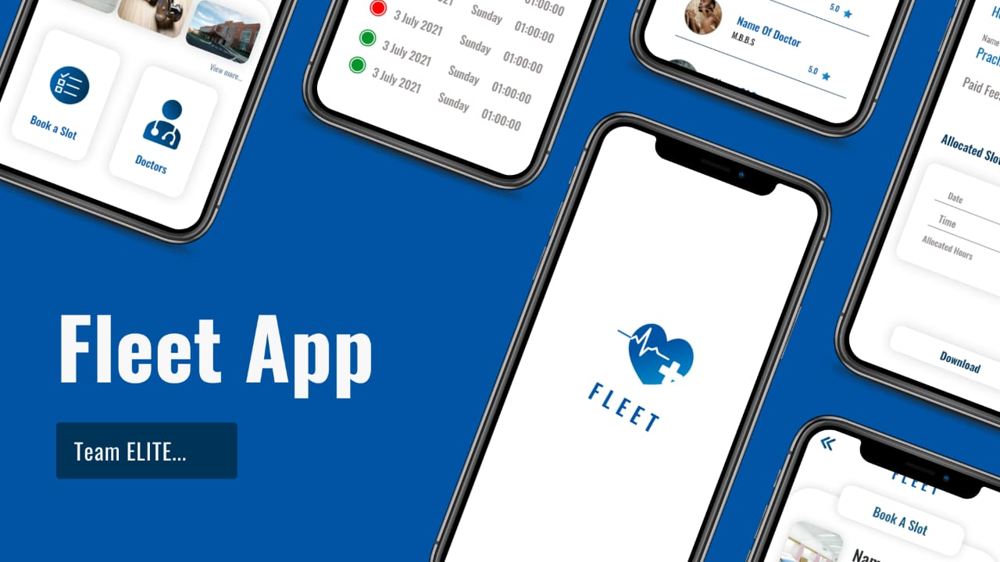
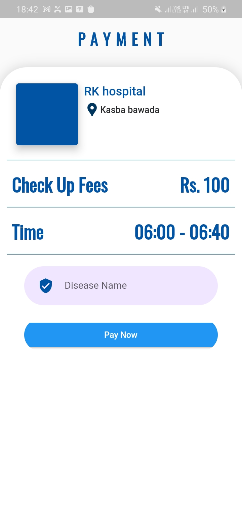
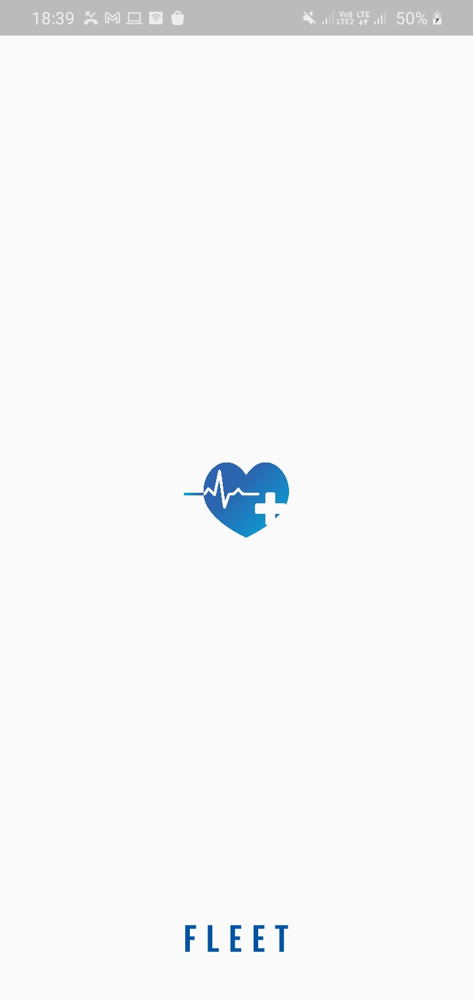
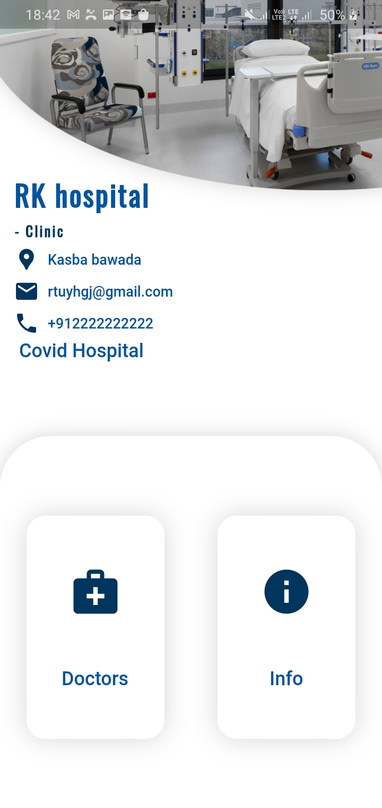
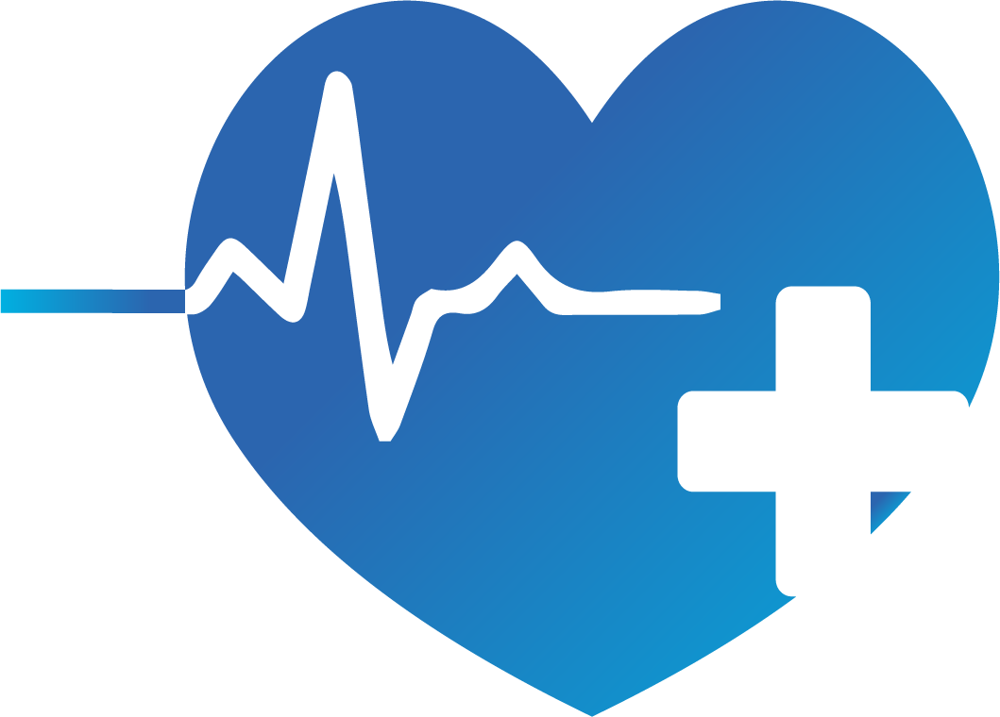

# Fleet
The pandemic hit last year shook health sector completely. A portal first of its kind to connect health services and needy at one click. Keeping track of availability of doctors which will be prove as a boon in emergency cases .
Advance registration will effectively manage the crowd at hospitals and in turn the adverse effect of the crowd can be avoided .

Android 
-----

</img>

### Instructions

  
- Sign-up while first accessing the app
- Login for next usages
- Select best suited hospitals/clinics
- Choose from available slots
- Make Payment

  (For Hospitals)
- Add doctor's details
- Add Slots

Install
---------
The app will be hosted on playstore soon.
